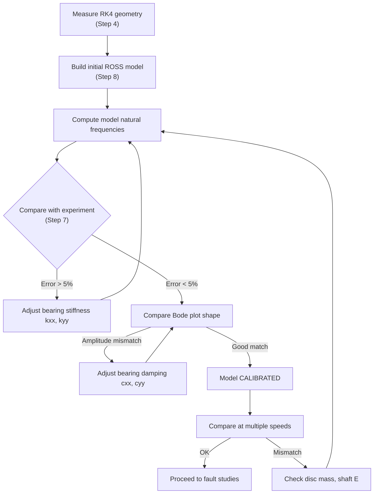
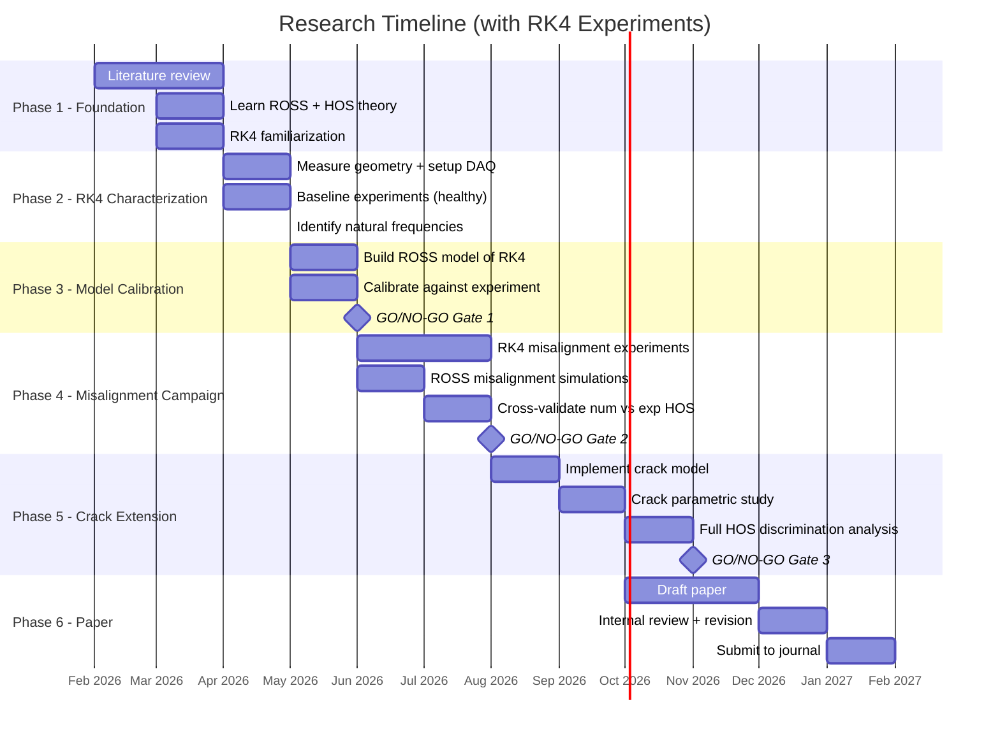

# Working Plan: Numerical and Experimental Fault Diagnosis Using the Bently Nevada RK4 Rotor Kit

> **Author:** Cristofer Antoni Souza Costa
> **Program:** M.Sc. Mechanical Engineering (POSMEC) -- UFU
> **Advisor:** Prof. Dr. Aldemir Aparecido Cavallini Junior
> **Date:** February 2026
> **Rig:** Bently Nevada RK4 Rotor Kit with Antifriction (Rolling-Element) Bearings

---

## Table of Contents

1. [Revised Research Strategy](#1-revised-research-strategy)
2. [The Bently Nevada RK4 Rotor Kit](#2-the-bently-nevada-rk4-rotor-kit)
3. [Experimental Setup](#3-experimental-setup)
4. [Step-by-Step Working Plan](#4-step-by-step-working-plan)
5. [Experiment Matrix](#5-experiment-matrix)
6. [FEM Model Calibration Procedure](#6-fem-model-calibration-procedure)
7. [HOS Pipeline for Experimental and Numerical Data](#7-hos-pipeline-for-experimental-and-numerical-data)
8. [Revised Timeline](#8-revised-timeline)
9. [Revised Risk Assessment and Go/No-Go Gates](#9-revised-risk-assessment-and-gono-go-gates)
10. [Deliverables Checklist](#10-deliverables-checklist)

---

## 1. Revised Research Strategy

### 1.1 What Changed

The original plan was a **purely numerical investigation**. With access to a Bently Nevada RK4 Rotor Kit with antifriction bearings, the research becomes a **combined numerical and experimental study**. This fundamentally strengthens the work:

| Aspect | Original Plan (numerical only) | Revised Plan (numerical + experimental) |
|---|---|---|
| Paper title scope | "...A Numerical Investigation" | "...A Numerical and Experimental Study" |
| Publishability score | ~3.3 / 5 | **~4.5 / 5** |
| Risk R8 (no experiments) | High | **Eliminated** |
| Target journal | Mid-tier (JSV, SHM) | **Top-tier (MSSP) viable** |
| Reviewer confidence | "Why no experiments?" | "Validated methodology" |
| Contribution | Methodology only | **Methodology + Experimental validation** |

### 1.2 The Core Argument (updated)

> "We validate a HOS-based fault diagnosis methodology using experimental misalignment data from a Bently Nevada RK4 rig. Having established numerical model fidelity, we extend the validated approach to study shaft cracks -- a fault that is difficult and destructive to reproduce experimentally -- via parametric FEM simulations."

This is a textbook structure for engineering research: **validate on what you can test, then predict what you cannot.**

### 1.3 What the RK4 Can and Cannot Do

| Fault | RK4 Experiment | Numerical (ROSS) | Role in Paper |
|---|---|---|---|
| Healthy (baseline) | **Yes** | Yes | Calibration + baseline reference |
| Mass unbalance | **Yes** (trial weights) | Yes | Model validation |
| Misalignment | **Yes** (adjustable coupling) | Yes | **Cross-validation** of HOS methodology |
| Shaft crack | **No** (destructive) | Yes | **Numerical extension** beyond experiment |

---

## 2. The Bently Nevada RK4 Rotor Kit

### 2.1 General Description

The Bently Nevada RK4 Rotor Kit is a benchtop educational and research rotor dynamics platform manufactured by Bently Nevada (now Baker Hughes). It is widely used in university rotordynamics labs worldwide.

### 2.2 Key Components (Antifriction Bearing Configuration)

```
┌─────────────────────────────────────────────────────────────────────┐
│                    BENTLY NEVADA RK4 ROTOR KIT                     │
│                  (Antifriction Bearing Configuration)               │
│                                                                     │
│  ┌───────┐    ┌───────┐         ┌──────┐         ┌───────┐        │
│  │ Motor │────│Coupling│────────── Disc  ─────────│Bearing│        │
│  │(VFD)  │    │(flex.) │  Shaft  │(mid) │  Shaft  │(right)│        │
│  └───────┘    └───────┘         └──────┘         └───────┘        │
│                  ▲                 ▲                  ▲             │
│              Bearing            Probes            Bearing          │
│              (left)            (X + Y)           (right)           │
│                                                                     │
│  Proximity probes: 2 per measurement plane (X and Y, 90° apart)   │
│  Keyphasor: 1x per revolution reference pulse                      │
└─────────────────────────────────────────────────────────────────────┘
```

### 2.3 Typical RK4 Specifications (verify against your unit)

| Parameter | Typical Value | Action Required |
|---|---|---|
| Shaft diameter | ~10 mm (3/8" or 10 mm) | **Measure your shaft precisely** |
| Shaft length (bearing span) | ~560 mm (22") | **Measure your shaft precisely** |
| Shaft material | AISI 4140 steel | Confirm with manual |
| Disc diameter | ~75 mm (3") | **Measure** |
| Disc thickness | ~25 mm (1") | **Measure** |
| Disc mass | ~0.8 kg | **Weigh on precision scale** |
| Bearings | Rolling-element (antifriction) | Note bearing model number |
| Speed range | 0 -- 10,000 RPM | Confirm with VFD settings |
| First critical speed | ~3,000 -- 5,000 RPM (depends on config) | **Measure experimentally** |
| Probes | Bently Nevada 3300 XL series (eddy current proximity) | Confirm probe sensitivity |
| Probe sensitivity | ~7.87 V/mm (200 mV/mil) typical | **Verify from calibration data** |
| Keyphasor | 1/rev optical or eddy current | Confirm type |
| DAQ system | ADRE / Ascent / or external | **Confirm what you have** |

> **IMPORTANT:** Before any experiment, you MUST measure and document the actual dimensions of YOUR specific RK4 unit. Do not rely on generic values. Small differences in shaft diameter dramatically affect natural frequencies.

### 2.4 Antifriction Bearings -- What This Means for the Research

With antifriction (rolling-element) bearings instead of journal (oil-film) bearings:

| Aspect | Impact |
|---|---|
| **Bearing stiffness** | Very high and approximately constant (no speed-dependent cross-coupling) |
| **Damping** | Very low (less energy dissipation than oil-film bearings) |
| **Cross-coupling** | Negligible (kxy ≈ kyx ≈ 0) -- simplifies the model significantly |
| **Modeling in ROSS** | Simpler: use `BearingElement` with only kxx, kyy, cxx, cyy (no cross terms) |
| **Dynamic behavior** | Sharper resonance peaks (low damping), clearer harmonics |
| **HOS advantage** | Low damping means stronger harmonic content → better bispectrum signal |

This is actually **good news** for your research. Low damping and no cross-coupling means:
- Cleaner vibration signals with well-defined harmonics
- Simpler numerical model (fewer parameters to estimate)
- Better bispectrum resolution (stronger spectral peaks)

---

## 3. Experimental Setup

### 3.1 Physical Setup Diagram

```
                          EXPERIMENTAL SETUP
                          ==================

     SIDE VIEW:
     ──────────

     Motor ──── Coupling ──── Shaft ──── Disc ──── Shaft ──── Bearing
       │         (flex.)       │          │         │          (right)
       │           │           │          │         │
       │        Bearing      Probe      Probe     Probe
       │        (left)      Plane 1    Plane 2   Plane 3
       │                    (opt.)    (at disc)  (opt.)
       │
     VFD (Variable Frequency Drive)
       │
     Power supply


     TOP VIEW (Probe arrangement at measurement plane):
     ─────────────────────────────────────────────────

                    Y probe (vertical)
                        │
                        │
                        ▼
            ┌───────────────────────┐
            │                       │
     X probe│──►    ○ Shaft         │  Probes at 90° apart
     (horiz)│      (cross section)  │
            │                       │
            └───────────────────────┘


     DAQ SIGNAL FLOW:
     ────────────────

     Proximity ──►  Signal         ──►  DAQ Card    ──►  Computer
     Probes        Conditioner          (NI / ADRE)      (Python /
     (X, Y)        (Proximitor)                           ADRE software)
        │
     Keyphasor ──────────────────────────────────────────►
     (1/rev)
```

### 3.2 Required Equipment Checklist

| Item | Purpose | Status |
|---|---|---|
| RK4 Rotor Kit (assembled) | Test rig | [ ] Available |
| Antifriction bearing set | Shaft support | [ ] Installed |
| Flexible coupling | Motor-shaft connection | [ ] Installed |
| Variable Frequency Drive (VFD) | Speed control | [ ] Available |
| Proximity probes (X and Y pair) | Displacement measurement | [ ] Installed and calibrated |
| Keyphasor probe | 1/rev phase reference | [ ] Installed |
| Proximitor / signal conditioner | Probe signal conditioning (-24V supply) | [ ] Available |
| DAQ system (NI, ADRE, or similar) | Data acquisition | [ ] Available |
| Trial weight set | Unbalance experiments | [ ] Available |
| Misalignment shims / adjustable base | Introduce known misalignment | [ ] Available |
| Dial indicator (0.01 mm resolution) | Measure misalignment offset | [ ] Available |
| Laser alignment tool (optional) | Precise alignment measurement | [ ] Available |
| Digital caliper (0.01 mm) | Measure shaft, disc dimensions | [ ] Available |
| Precision scale (0.1 g) | Weigh disc and trial weights | [ ] Available |
| Tachometer (or use keyphasor) | Verify RPM | [ ] Available |
| Safety glasses and ear protection | Lab safety | [ ] Available |

### 3.3 Sensor Configuration

#### 3.3.1 Proximity Probe Installation

| Probe | Location | Orientation | Purpose |
|---|---|---|---|
| Probe X1 | Near left bearing (outboard of bearing, closest accessible point) | Horizontal (0°) | Horizontal displacement |
| Probe Y1 | Same axial location as X1 | Vertical (90°) | Vertical displacement |
| Probe X2 | Near disc (midspan) | Horizontal (0°) | Midspan horizontal displacement |
| Probe Y2 | Same axial location as X2 | Vertical (90°) | Midspan vertical displacement |
| Keyphasor | Near coupling end | Radial, pointing at keyphasor notch | 1/rev reference |

**Probe gap setting:**
- Target gap voltage: -10V DC (midrange of the probe's linear range)
- This corresponds to approximately 1.27 mm (50 mil) gap for 3300 XL probes
- Adjust using the probe mounting hardware until the DC voltage reads -10V on a multimeter

> **Note:** If you have only one pair of probes (X + Y), install them at the disc location (midspan). This is where the vibration amplitude is highest and gives the best signal for HOS analysis.

#### 3.3.2 DAQ Settings

| Parameter | Recommended Value | Rationale |
|---|---|---|
| Sampling rate | 4096 Hz minimum (8192 Hz preferred) | Captures up to ~4000 Hz (many harmonics above running speed) |
| Acquisition duration | 60 seconds per steady-state measurement | Provides sufficient data for bispectrum segment averaging |
| Anti-aliasing filter | Set at 40% of sampling rate | Prevents aliasing artifacts |
| Input range | ±10V (match proximitor output range) | Avoid clipping |
| Number of channels | 2 minimum (X + Y) + keyphasor | X displacement is the primary HOS signal |
| Trigger | Keyphasor pulse (rising edge) | Synchronous averaging capability |
| File format | CSV, TDMS, or HDF5 | Python-compatible for post-processing |

### 3.4 Misalignment Introduction Procedure

The RK4 allows controlled misalignment at the coupling between the motor and the shaft. With antifriction bearings, you introduce **parallel misalignment** by offsetting the motor or bearing pedestals.

#### Step-by-step to introduce known misalignment:

```
1. Start from ALIGNED condition:
   - Use dial indicator on coupling hubs
   - Rotate shaft by hand through 360°
   - TIR (Total Indicated Runout) should be < 0.025 mm
   - Record baseline alignment readings

2. Introduce PARALLEL OFFSET:
   - Place precision shims under ONE bearing pedestal
   - Shim thickness = desired offset (e.g., 0.1 mm, 0.2 mm, 0.3 mm)
   - Re-measure alignment with dial indicator
   - Record actual offset achieved

3. Introduce ANGULAR MISALIGNMENT (alternative):
   - Place shims under one side of a bearing pedestal
   - Creates a tilt → angular offset at the coupling
   - Measure angular offset in mrad using dial indicator readings at two axial positions

4. DOCUMENT everything:
   - Photograph the setup
   - Record shim thickness, pedestal position
   - Record dial indicator readings (4 positions: top, bottom, left, right)
   - Calculate actual offset from readings
```

**Recommended misalignment levels:**

| Level | Parallel Offset | Description |
|---|---|---|
| 0 (baseline) | < 0.025 mm | Aligned (reference) |
| 1 (light) | 0.10 mm | Mild misalignment |
| 2 (moderate) | 0.20 mm | Moderate misalignment |
| 3 (severe) | 0.30 mm | Severe misalignment |
| 4 (extreme) | 0.50 mm | Near operational limit |

> **Safety:** Do not exceed 0.5 mm offset on the RK4. Excessive misalignment can damage the flexible coupling or overload the bearings. Always listen for unusual sounds and monitor vibration levels during ramp-up.

---

## 4. Step-by-Step Working Plan

### Overview of All Steps

```mermaid
graph TD
    subgraph phase1 [Phase 1: Foundation - Months 1-2]
        S1["Step 1: Literature Review"]
        S2["Step 2: Learn ROSS + HOS Theory"]
        S3["Step 3: RK4 Familiarization"]
    end

    subgraph phase2 [Phase 2: RK4 Characterization - Months 2-3]
        S4["Step 4: Measure RK4 Geometry"]
        S5["Step 5: Setup DAQ + Sensors"]
        S6["Step 6: Baseline Experiments (Healthy)"]
        S7["Step 7: Identify Natural Frequencies"]
    end

    subgraph phase3 [Phase 3: Model Calibration - Months 3-4]
        S8["Step 8: Build ROSS Model of RK4"]
        S9["Step 9: Calibrate Model vs Experiment"]
        S10["Step 10: Go/No-Go Gate 1"]
    end

    subgraph phase4 [Phase 4: Misalignment Campaign - Months 4-6]
        S11["Step 11: Run Misalignment Experiments"]
        S12["Step 12: Run Misalignment Simulations"]
        S13["Step 13: Cross-Validate Num vs Exp HOS"]
        S14["Step 14: Go/No-Go Gate 2"]
    end

    subgraph phase5 [Phase 5: Crack Simulation Extension - Months 6-8]
        S15["Step 15: Implement Crack Model in ROSS"]
        S16["Step 16: Run Crack Parametric Study"]
        S17["Step 17: HOS Analysis (Crack vs Misalignment)"]
        S18["Step 18: Go/No-Go Gate 3"]
    end

    subgraph phase6 [Phase 6: Paper - Months 8-12]
        S19["Step 19: Draft Paper"]
        S20["Step 20: Submit to Journal"]
    end

    S1 --> S2 --> S3
    S3 --> S4 --> S5 --> S6 --> S7
    S7 --> S8 --> S9 --> S10
    S10 --> S11 --> S12 --> S13 --> S14
    S14 --> S15 --> S16 --> S17 --> S18
    S18 --> S19 --> S20
```



---

### Step 1: Literature Review (Weeks 1-6)

**Goal:** Build theoretical foundation and understand the state-of-the-art.

**Actions:**
1. Read and annotate 25-40 papers across these categories:

| Category | Key Authors / Topics | # Papers |
|---|---|---|
| Rotordynamics fundamentals | Muszynska, Friswell & Penny, Lalanne | 4-6 |
| Breathing crack models | Mayes-Davies, Gasch, Darpe, Papadopoulos | 4-5 |
| Misalignment dynamics | Patel & Darpe, Sekhar & Prabhu, Xu & Marangoni | 3-4 |
| HOS theory | Nikias & Petropulu, Collis et al., Fackrell | 3-4 |
| HOS in rotating machinery | Sinha (2007), Yunusa-Kaltungo, Li et al. | 4-6 |
| Vibration-based fault diagnosis | Randall, Jardine et al. | 3-4 |
| Numerical rotordynamics validation | Timbó (ROSS), Friswell benchmarks | 2-3 |
| RK4 rotor kit studies | Any published work using Bently Nevada kits | 2-3 |

2. Write an annotated bibliography (store in `01_article/` or a `references/` folder).
3. For each paper, note: methodology, key results, limitations, and how it relates to your work.

**Deliverable:** Annotated bibliography document, initial literature review draft.

---

### Step 2: Learn ROSS and HOS Theory (Weeks 3-6, overlaps with Step 1)

**Goal:** Hands-on competence with the tools.

**Actions:**
1. Install ROSS in your `research` environment:
   ```bash
   mamba activate research
   pip install ross-rotordynamics
   ```
2. Run all ROSS tutorial notebooks from the [documentation](https://ross.readthedocs.io).
3. Build a simple Jeffcott rotor, compute Campbell diagram, unbalance response.
4. Study bispectrum theory:
   - Implement the bispectrum function from `03_ross_agent_prompt.md`
   - Test it on a synthetic signal: `x(t) = cos(w*t) + 0.5*cos(2*w*t + phi)` (known phase coupling)
   - Verify the bispectrum shows a peak at (w, w) with the correct biphase
5. Study bicoherence: implement and test normalization.

**Deliverable:** Working Jupyter notebooks for ROSS basics and HOS computation on synthetic signals.

---

### Step 3: RK4 Familiarization (Week 4-5)

**Goal:** Understand your specific RK4 unit before any measurement.

**Actions:**
1. Read the Bently Nevada RK4 manual cover-to-cover.
2. Identify all components on your unit (visually and by part number).
3. Power on the motor and VFD, practice speed control (no measurements yet).
4. Run the shaft from 0 to ~3000 RPM by hand, listen and feel for any issues.
5. Verify all probes are reading on the DAQ (DC voltage within range).
6. Practice the DAQ software: acquire a short test recording, export as CSV, load in Python.

**Deliverable:** Familiarity log noting unit condition, component list, and DAQ test confirmation.

---

### Step 4: Measure RK4 Geometry (Week 5, 1-2 days)

**Goal:** Document every physical dimension of your specific RK4 unit.

**Measurement protocol:**

| Measurement | Tool | Record (mm) |
|---|---|---|
| Shaft outer diameter (at 3 locations along span) | Digital caliper | _______ |
| Shaft total length (motor coupling to free end) | Tape measure / caliper | _______ |
| Bearing span (center-to-center of bearings) | Caliper / tape | _______ |
| Distance: left bearing center to disc center | Caliper | _______ |
| Distance: disc center to right bearing center | Caliper | _______ |
| Disc outer diameter | Caliper | _______ |
| Disc inner diameter (bore) | Caliper | _______ |
| Disc thickness | Caliper | _______ |
| Disc mass | Precision scale (g) | _______ |
| Shaft mass (if removable) | Precision scale (g) | _______ |
| Coupling type and dimensions | Visual inspection | _______ |
| Bearing model number | Read from bearing | _______ |
| Probe axial locations (from left bearing) | Caliper | _______ |
| Probe angular positions (from top, clockwise) | Protractor | _______ |

**Also note:**
- Shaft material (check manual, typically AISI 4140)
- Bearing manufacturer and model (for looking up stiffness data)
- Coupling type (jaw, disc, spiral beam?)
- Motor specifications (power, rated RPM)

**Deliverable:** Completed geometry data sheet (fill the table above and store in a document).

---

### Step 5: Setup DAQ and Sensors (Week 5-6)

**Goal:** Configure the data acquisition chain and verify signal quality.

**Actions:**
1. Install and gap all proximity probes (target -10V DC at gap).
2. Connect probes → proximitor → DAQ channels.
3. Connect keyphasor → DAQ trigger channel.
4. Configure DAQ software:
   - Sampling rate: 8192 Hz
   - Channels: X1, Y1 (and X2, Y2 if available), keyphasor
   - Duration: 60 seconds
   - File format: CSV or TDMS
5. With rotor stationary, record a noise floor measurement (60 seconds).
6. With rotor at ~1000 RPM:
   - Record 60 seconds of data
   - Load in Python, plot the time signal
   - Verify you see a clean sinusoidal signal at 1X (~16.7 Hz)
   - Compute PSD and verify 1X peak is dominant
7. Check signal-to-noise ratio (SNR): 1X peak should be at least 40 dB above noise floor.

**Deliverable:** DAQ configuration document + Python notebook showing clean signals at 1000 RPM.

---

### Step 6: Baseline Experiments -- Healthy Rotor (Week 6-7)

**Goal:** Characterize the healthy rotor across the operating speed range.

**Experiment protocol:**

| Run # | Speed (RPM) | Duration (s) | Notes |
|---|---|---|---|
| H-01 | 500 | 60 | Well below 1st critical |
| H-02 | 1000 | 60 | Low speed |
| H-03 | 1500 | 60 | Moderate speed |
| H-04 | 2000 | 60 | Approaching 1st critical |
| H-05 | 2500 | 60 | Near 1st critical |
| H-06 | 3000 | 60 | At or near 1st critical |
| H-07 | 3500 | 60 | Above 1st critical |
| H-08 | 4000 | 60 | Well above 1st critical |
| H-09 | Coastdown (3000→0) | full duration | Bode plot data |

**For each run:**
1. Set speed on VFD, wait 30 seconds for steady state.
2. Start acquisition (60 seconds).
3. Save file with naming convention: `healthy_XXXX_rpm_run01.csv`
4. Record ambient temperature and any observations.

**Post-processing (in Python):**
- Plot time signals (last 10 seconds of each run)
- Compute PSD for each run
- Build a waterfall/cascade plot (PSD vs. speed) -- this is essentially a Campbell diagram from experimental data
- Identify the 1st critical speed (peak amplitude in Bode plot from coastdown)
- Compute the bispectrum for each run (healthy baseline HOS reference)

**Deliverable:** Experimental baseline dataset + Jupyter notebook with PSD, Bode plot, and baseline bispectrum.

---

### Step 7: Identify Natural Frequencies (Week 7)

**Goal:** Extract the modal parameters of the healthy rotor.

**Actions:**
1. From the coastdown data (H-09), plot amplitude and phase vs. RPM (Bode plot).
2. Identify the 1st critical speed (peak amplitude + 90° phase shift).
3. If possible, identify the 2nd critical speed.
4. Estimate damping ratio from the half-power bandwidth method:
   ```
   ζ = (f2 - f1) / (2 * fn)
   ```
   where f1 and f2 are the frequencies at -3 dB from the resonance peak.
5. Record these values -- they are the validation targets for the numerical model.

**Expected results for a typical RK4 with antifriction bearings:**

| Parameter | Expected Range | Your Measurement |
|---|---|---|
| 1st critical speed | 2500 -- 5000 RPM | _______ RPM |
| 1st natural frequency | 42 -- 83 Hz | _______ Hz |
| Damping ratio (1st mode) | 0.005 -- 0.03 | _______ |

**Deliverable:** Experimental modal parameters table (critical speed, natural frequency, damping ratio).

---

### Step 8: Build ROSS Model of the RK4 (Weeks 7-8)

**Goal:** Create a FEM model in ROSS that matches your physical RK4 rig.

**Actions:**
1. Use your measured geometry (Step 4) to define the ROSS model:

```python
import ross as rs
import numpy as np

# --------------------------------------------------
# MATERIAL (confirm properties for your shaft steel)
# --------------------------------------------------
steel = rs.Material(
    name="AISI_4140",
    E=205e9,          # Young's modulus [Pa]
    G_s=80e9,         # Shear modulus [Pa]
    rho=7850,         # Density [kg/m3]
)

# --------------------------------------------------
# SHAFT ELEMENTS
# Fill with YOUR measured dimensions
# --------------------------------------------------
L_total = 0.560      # Total bearing span [m] -- MEASURE THIS
n_elements = 20      # Number of FEM elements
L_elem = L_total / n_elements

shaft_elements = []
for i in range(n_elements):
    shaft_elements.append(
        rs.ShaftElement(
            L=L_elem,
            idl=0,                    # Inner diameter left [m] (solid shaft = 0)
            odl=0.010,                # Outer diameter left [m] -- MEASURE THIS
            idr=0,                    # Inner diameter right [m]
            odr=0.010,                # Outer diameter right [m]
            material=steel,
        )
    )

# --------------------------------------------------
# DISC (at midspan, node = n_elements // 2)
# --------------------------------------------------
disc_node = n_elements // 2  # midspan
disc = rs.DiskElement.from_geometry(
    n=disc_node,
    material=steel,
    width=0.025,        # Disc thickness [m] -- MEASURE THIS
    i_d=0.010,          # Disc inner diameter [m] -- MEASURE THIS
    o_d=0.075,          # Disc outer diameter [m] -- MEASURE THIS
)

# --------------------------------------------------
# BEARINGS (antifriction -- simplified isotropic model)
# Start with estimated values, calibrate later
# --------------------------------------------------
bearing_left = rs.BearingElement(
    n=0,
    kxx=1e7,   # [N/m] -- initial guess, will be calibrated
    kyy=1e7,   # [N/m]
    cxx=50,    # [N.s/m] -- antifriction bearings have LOW damping
    cyy=50,    # [N.s/m]
)
bearing_right = rs.BearingElement(
    n=n_elements,
    kxx=1e7,
    kyy=1e7,
    cxx=50,
    cyy=50,
)

# --------------------------------------------------
# ASSEMBLE ROTOR
# --------------------------------------------------
rotor = rs.Rotor(
    shaft_elements=shaft_elements,
    disk_elements=[disc],
    bearing_elements=[bearing_left, bearing_right],
)

# Check
print(f"Number of nodes: {rotor.nodes}")
print(f"Total shaft length: {sum([s.L for s in shaft_elements]):.4f} m")

# Plot
fig = rotor.plot_rotor()
fig.show()
```

2. Compute natural frequencies at 0 RPM and compare with your experimental values.
3. Compute Campbell diagram.
4. Compute unbalance response.

**Deliverable:** ROSS model notebook with initial (uncalibrated) model results.

---

### Step 9: Calibrate Model Against Experiment (Weeks 8-9)

**Goal:** Tune the ROSS model so it matches the experimental RK4 data.

**Calibration target:** The 1st critical speed from the model must match the experimental value within ±5%.

**Calibration procedure:**

```
1. INITIAL COMPARISON:
   - Compute 1st natural frequency from ROSS model
   - Compare with experimental 1st critical speed
   - Likely: they won't match on first try

2. PARAMETER SENSITIVITY CHECK:
   Which parameter has the biggest effect on the 1st critical speed?

   For antifriction bearings:
   - Bearing stiffness (kxx, kyy) → BIGGEST effect if bearings are not infinitely stiff
   - Shaft diameter → known from measurement (fixed)
   - Disc mass → known from measurement (fixed)
   - Shaft E modulus → known from material tables (fixed)

3. TUNING STRATEGY:
   a. If model frequency is TOO HIGH → reduce bearing stiffness
   b. If model frequency is TOO LOW → increase bearing stiffness
   c. Iterate until:
      |f_model - f_experiment| / f_experiment < 0.05  (within 5%)

4. FINE TUNING:
   - Adjust damping (cxx, cyy) to match the experimental Bode plot amplitude at resonance
   - Higher damping → lower peak amplitude at critical speed
   - Match damping ratio from half-power bandwidth (Step 7)

5. VALIDATION:
   - Compare unbalance response amplitude vs. speed (Bode plot) -- model vs. experiment
   - Compare orbit shapes at 2-3 speeds
```

**Simplified Python calibration loop:**

```python
import numpy as np
from scipy.optimize import minimize_scalar

def critical_speed_error(log_k, target_freq_hz, rotor_builder_func):
    """Objective: minimize |f_model - f_target|."""
    k = 10**log_k
    rotor = rotor_builder_func(kxx=k, kyy=k)
    modal = rotor.run_modal(speed=0)
    f_model = modal.wn[0] / (2 * np.pi)  # 1st natural freq in Hz
    return (f_model - target_freq_hz)**2

# target_freq_hz = YOUR EXPERIMENTAL VALUE from Step 7
# Use scipy.optimize.minimize_scalar to find optimal bearing stiffness
```

**Deliverable:** Calibrated ROSS model with documented bearing parameters + comparison plots (model vs. experiment).

---

### Step 10: Go/No-Go Gate 1 -- Model Fidelity (Week 9)

| Criterion | Pass | Fail Action |
|---|---|---|
| 1st critical speed within ±5% of experiment | Proceed | Re-examine shaft geometry, bearing model |
| Unbalance response shape matches Bode plot qualitatively | Proceed | Check bearing damping, disc mass |
| ROSS time integration works for unbalance case | Proceed to Phase 4 | Implement custom integrator with SciPy |

**Decision:** If all three pass → proceed to misalignment experiments. If any fail → iterate on model until resolved.

---

### Step 11: Run Misalignment Experiments on RK4 (Weeks 9-12)

**Goal:** Acquire vibration data from the RK4 under controlled misalignment conditions.

**Experiment matrix:**

| Run ID | Misalignment (mm) | Speed (RPM) | Duration (s) | File Name |
|---|---|---|---|---|
| M0-1500 | 0.00 (aligned) | 1500 | 60 | `misal_0.00mm_1500rpm.csv` |
| M0-2500 | 0.00 (aligned) | 2500 | 60 | `misal_0.00mm_2500rpm.csv` |
| M0-3000 | 0.00 (aligned) | 3000 | 60 | `misal_0.00mm_3000rpm.csv` |
| M1-1500 | 0.10 | 1500 | 60 | `misal_0.10mm_1500rpm.csv` |
| M1-2500 | 0.10 | 2500 | 60 | `misal_0.10mm_2500rpm.csv` |
| M1-3000 | 0.10 | 3000 | 60 | `misal_0.10mm_3000rpm.csv` |
| M2-1500 | 0.20 | 1500 | 60 | `misal_0.20mm_1500rpm.csv` |
| M2-2500 | 0.20 | 2500 | 60 | `misal_0.20mm_2500rpm.csv` |
| M2-3000 | 0.20 | 3000 | 60 | `misal_0.20mm_3000rpm.csv` |
| M3-1500 | 0.30 | 1500 | 60 | `misal_0.30mm_1500rpm.csv` |
| M3-2500 | 0.30 | 2500 | 60 | `misal_0.30mm_2500rpm.csv` |
| M3-3000 | 0.30 | 3000 | 60 | `misal_0.30mm_3000rpm.csv` |
| M4-1500 | 0.50 | 1500 | 60 | `misal_0.50mm_1500rpm.csv` |
| M4-2500 | 0.50 | 2500 | 60 | `misal_0.50mm_2500rpm.csv` |
| M4-3000 | 0.50 | 3000 | 60 | `misal_0.50mm_3000rpm.csv` |

**Total: 15 runs** (5 misalignment levels x 3 speeds). Repeat each run 3 times for statistical robustness → **45 total acquisitions**.

**Procedure for each misalignment level:**
1. Shut down motor.
2. Introduce misalignment (shims under bearing pedestal).
3. Measure and record actual offset with dial indicator.
4. Start motor, ramp to target speed, wait 30 seconds for steady state.
5. Acquire 60 seconds of data.
6. Repeat for all 3 speeds.
7. Shut down, proceed to next misalignment level.

> **Safety protocol:** Always ramp up slowly. If vibration amplitude exceeds 100 μm peak-to-peak (or feels excessive), shut down immediately and reduce misalignment or speed.

**Deliverable:** Complete experimental misalignment dataset (45 CSV files, organized in folders by misalignment level).

---

### Step 12: Run Misalignment Simulations in ROSS (Weeks 10-12, parallel with Step 11)

**Goal:** Simulate the same conditions numerically using the calibrated ROSS model.

**Actions:**
1. Implement misalignment forcing in the ROSS model (harmonic forces at 1X, 2X, 3X at the coupling node).
2. Run the same 15 cases (5 offsets x 3 speeds) in ROSS.
3. Extract time-domain displacement at the same node where the experimental probe is located.
4. Store all results in a structured format.

**Deliverable:** Numerical misalignment dataset (15 simulation cases).

---

### Step 13: Cross-Validate Numerical vs. Experimental HOS (Weeks 12-14)

**Goal:** This is the core validation step. Compare bispectrum from experiment with bispectrum from simulation.

**Actions:**
1. Compute bispectrum and bicoherence for all 15 experimental cases.
2. Compute bispectrum and bicoherence for all 15 numerical cases.
3. Compare side-by-side:
   - Bispectrum magnitude maps: do the peak locations match?
   - Bicoherence patterns: do the normalized coupling patterns match?
   - Biphase angles: do the phase values at (1X,1X) and (1X,2X) agree?
4. Compute quantitative similarity metrics:
   - Normalized correlation between experimental and numerical bispectrum
   - Relative error in peak magnitudes at key frequency pairs
5. Plot the comparison figures (these go directly into the paper).

**What "match" means:**
- Peak locations (frequency pairs) must agree exactly (they are dictated by physics).
- Peak magnitudes may differ by up to 50% (model is approximate).
- Biphase angles should agree within ±30° (phase is the discriminating feature).
- Overall bispectrum pattern (shape) must be qualitatively similar.

**Deliverable:** Cross-validation notebook with side-by-side comparison figures and similarity metrics.

---

### Step 14: Go/No-Go Gate 2 -- HOS Cross-Validation (Week 14)

| Criterion | Pass | Fail Action |
|---|---|---|
| Bispectrum peaks at same frequency pairs (num vs exp) | Proceed | Check fault model, signal processing settings |
| Biphase agreement within ±30° | Proceed | Investigate phase convention, probe orientation |
| Misalignment HOS signature strengthens with increasing offset | Proceed | Review forcing model amplitude scaling |
| Bicoherence patterns qualitatively similar | Proceed to crack study | Revisit bispectrum estimation parameters |

**Decision:** If all pass → the numerical methodology is validated for misalignment. You can now trust it for cracks.

---

### Step 15: Implement Breathing Crack Model in ROSS (Weeks 14-16)

**Goal:** Add crack simulation capability to the validated ROSS model.

**Actions:**
1. Implement a breathing crack model (Mayes-Davies or switching stiffness) at a chosen node.
2. The crack introduces time-varying stiffness: `K(t) = K0 - ΔK * f(θ(t))`
   - `f(θ)` is the breathing function: `f(θ) = (1 - cos(θ)) / 2`
   - `ΔK` scales with crack depth ratio `a/D`
3. If ROSS does not support time-varying K natively:
   - Extract M, C, G, K matrices from ROSS
   - Modify K at each time step according to the breathing function
   - Integrate with `scipy.integrate.solve_ivp` (RK45 or Newmark-beta)
4. Verify: a cracked shaft should show 2X and 3X harmonics in the PSD.

**Deliverable:** Working crack model notebook, verified against expected harmonic content.

---

### Step 16: Run Crack Parametric Study (Weeks 16-18)

**Goal:** Systematic numerical study of crack severity effects.

**Simulation matrix:**

| Parameter | Values | Count |
|---|---|---|
| Crack depth ratio (a/D) | 0.0, 0.05, 0.1, 0.15, 0.2, 0.3, 0.4, 0.5 | 8 |
| Crack location | Midspan (node 10), 1/4 span (node 5) | 2 |
| Rotational speed | 1500, 2500, 3000 RPM (same as experiments) | 3 |

**Total: 8 x 2 x 3 = 48 simulations** (plus the 15 misalignment simulations from Step 12 = 63 total numerical cases).

**Deliverable:** Complete crack simulation dataset.

---

### Step 17: Full HOS Analysis -- Crack vs. Misalignment Discrimination (Weeks 18-22)

**Goal:** The climax of the research -- can HOS distinguish crack from misalignment?

**Actions:**
1. Compute bispectrum, bicoherence, and biphase for all 63 numerical cases.
2. Define and compute quantitative fault indicators:

| Indicator | Formula | What It Measures |
|---|---|---|
| **Bispectral Peak Ratio (BPR)** | \|B(1X,2X)\| / \|B(1X,1X)\| | Relative strength of cubic vs. quadratic coupling |
| **Bicoherence Sum (BCS)** | Σ b²(f1,f2) over defined region | Total nonlinear coupling energy |
| **Bispectral Entropy (BE)** | -Σ p·log(p), where p = \|B\|/Σ\|B\| | Complexity of nonlinear interactions |
| **Biphase at (1X,1X)** | arg(B(1X,1X)) | Phase signature of quadratic coupling |

3. Build the feature matrix: (63 cases x 4 indicators).
4. Plot discrimination results:
   - BPR vs. BCS scatter plot, colored by fault type (healthy / crack / misalignment)
   - Indicator vs. crack depth curves
   - Indicator vs. misalignment offset curves
   - Biphase comparison: crack vs. misalignment at (1X,1X)
5. Compare numerical crack HOS patterns with Sinha (2007) experimental patterns (qualitative validation).
6. Compare numerical misalignment HOS with YOUR experimental misalignment HOS (quantitative validation -- already done in Step 13, now add it to the full picture).

**Deliverable:** Complete results notebook with discrimination plots, indicator tables, and comparison figures.

---

### Step 18: Go/No-Go Gate 3 -- Discrimination (Week 22)

| Criterion | Pass | Fail Action |
|---|---|---|
| At least 2 indicators show >80% separability between crack and misalignment | Proceed to paper | Revisit indicators, try trispectrum, add more features |
| Biphase at (1X,1X) differs by >30° between crack and misalignment | Proceed | Investigate crack model nonlinearity |
| Crack HOS patterns are consistent with Sinha (2007) | Proceed | Review crack breathing model assumptions |
| Results are physically interpretable (not just statistical artifacts) | Proceed to paper | Deeper theoretical analysis needed |

---

### Step 19: Draft Paper (Weeks 22-28)

**Goal:** Write the journal paper.

**Updated paper structure (numerical + experimental):**

```
TITLE: Fault Diagnosis in Rotating Machinery Using Higher-Order Spectra:
       A Combined Numerical and Experimental Investigation

1. INTRODUCTION
2. THEORETICAL BACKGROUND
   2.1 Rotordynamics FEM
   2.2 Breathing Crack Model
   2.3 Misalignment Model
   2.4 Higher-Order Spectra Theory
3. EXPERIMENTAL SETUP
   3.1 Bently Nevada RK4 Rotor Kit Description
   3.2 Instrumentation and Data Acquisition
   3.3 Experimental Procedures
4. NUMERICAL METHODOLOGY
   4.1 FEM Model in ROSS
   4.2 Model Calibration Against Experimental Data
   4.3 Fault Implementation (Crack + Misalignment)
   4.4 HOS Processing Pipeline
5. RESULTS AND DISCUSSION
   5.1 Model Validation (Healthy Rotor)
   5.2 Misalignment: Experimental vs. Numerical HOS
   5.3 Crack: Numerical HOS Parametric Study
   5.4 Fault Discrimination: Crack vs. Misalignment
   5.5 Sensitivity Analysis
6. CONCLUSIONS
REFERENCES
```

**Target journal:** Mechanical Systems and Signal Processing (MSSP) -- now viable with experimental validation.

**Deliverable:** Submitted manuscript.

---

### Step 20: Submit (Week 28-30)

1. Final review with advisor.
2. Format according to MSSP guidelines.
3. Prepare supplementary material (code repository, experimental data).
4. Submit.

---

## 5. Experiment Matrix -- Complete Overview

### 5.1 Experimental Runs (on RK4)

| Experiment Set | # Conditions | # Speeds | # Repeats | Total Runs |
|---|---|---|---|---|
| Healthy baseline | 1 | 8 + coastdown | 3 | ~30 |
| Misalignment | 5 levels | 3 | 3 | 45 |
| **Total experimental** | | | | **~75 runs** |

### 5.2 Numerical Simulations (in ROSS)

| Simulation Set | # Conditions | # Speeds | Total Cases |
|---|---|---|---|
| Healthy baseline | 1 | 3 | 3 |
| Misalignment (matching experiments) | 5 levels | 3 | 15 |
| Crack (parametric extension) | 8 depths x 2 locations | 3 | 48 |
| **Total numerical** | | | **66 cases** |

### 5.3 HOS Computations

| Data Source | # Cases | HOS Output |
|---|---|---|
| Experimental (RK4) | ~75 | Bispectrum + bicoherence for each |
| Numerical (ROSS) | 66 | Bispectrum + bicoherence for each |
| **Total HOS computations** | **~141** | Feature matrix: 141 x 4 indicators |

---

## 6. FEM Model Calibration Procedure

### 6.1 Flowchart



### 6.2 Bearing Stiffness Estimation for Antifriction Bearings

For rolling-element bearings, initial stiffness estimates can come from:

1. **Bearing manufacturer datasheets** (look up the model number from your bearing).
2. **Harris formula** (simplified): For a deep-groove ball bearing under radial load:
   ```
   k_radial ≈ 3.4 × 10^7 × (n_balls)^(0.44) × (d_ball)^(0.64) × (F_r)^(0.3)  [N/m]
   ```
   where n_balls = number of balls, d_ball = ball diameter [mm], F_r = radial preload [N].
3. **Typical range for small bearings (RK4 size):** 10^6 to 10^8 N/m.
4. **Start with 10^7 N/m** and calibrate using Step 9 procedure.

---

## 7. HOS Pipeline for Experimental and Numerical Data

### 7.1 Signal Processing Chain (identical for both sources)

```
Raw time signal
    │
    ├── Remove first N seconds (transient)
    │
    ├── Detrend (remove DC offset)
    │
    ├── Apply window (optional for bispectrum; use rectangular or Hanning)
    │
    ├── Compute PSD (scipy.signal.welch)
    │     └── Output: PSD plot, 1X/2X/3X amplitudes
    │
    ├── Compute Bispectrum (direct method, segment averaging)
    │     ├── NFFT: 512 or 1024
    │     ├── Overlap: 50%
    │     ├── # Segments: depends on signal length
    │     └── Output: B(f1, f2) complex 2D matrix
    │
    ├── Compute Bicoherence (normalized bispectrum)
    │     └── Output: b²(f1, f2) real 2D matrix, values ∈ [0, 1]
    │
    ├── Extract Fault Indicators
    │     ├── BPR = |B(1X,2X)| / |B(1X,1X)|
    │     ├── BCS = Σ b²(f1,f2) in defined region
    │     ├── BE  = -Σ p·log(p)
    │     └── Biphase = arg(B(1X,1X))
    │
    └── Store in Feature Matrix
          └── Output: [case_id, fault_type, severity, speed, BPR, BCS, BE, biphase]
```

### 7.2 Key HOS Parameters

| Parameter | Value | Rationale |
|---|---|---|
| NFFT (segment length) | 512 samples | Frequency resolution = fs/NFFT = 8192/512 = 16 Hz (resolves 1X at 25 Hz) |
| Overlap | 50% | Standard for segment averaging |
| Window | Hanning | Reduces spectral leakage |
| Minimum # segments | 30 | Statistical reliability of bispectrum estimate |
| Required signal length | 512 × 30 / (0.5) / 8192 ≈ 3.75 seconds | Well within 60-second acquisition |
| Frequency range of interest | 0 -- 200 Hz | Covers up to 8X at 25 Hz running speed |

### 7.3 Bispectrum Frequency Pairs of Interest

For a rotor running at speed Ω (Hz):

| Frequency Pair (f1, f2) | Physical Meaning | Expected Behavior |
|---|---|---|
| (Ω, Ω) | Quadratic self-coupling of 1X → generates 2X | Strong for crack; present for misalignment |
| (Ω, 2Ω) | Coupling of 1X with 2X → generates 3X | Strong for crack; weaker for misalignment |
| (2Ω, 2Ω) | Quadratic self-coupling of 2X → generates 4X | Present for severe crack |
| Biphase at (Ω, Ω) | Phase of the quadratic coupling | **Key discriminator** between crack and misalignment |

---

## 8. Revised Timeline



| Phase | Period | Duration | Key Output |
|---|---|---|---|
| 1 -- Foundation | Feb -- Apr 2026 | 2 months | Literature, ROSS skill, RK4 familiarity |
| 2 -- RK4 Characterization | Apr -- May 2026 | 2 months | Baseline experimental data, modal parameters |
| 3 -- Model Calibration | May -- Jun 2026 | 2 months | Validated ROSS model of the RK4 |
| 4 -- Misalignment Campaign | Jun -- Aug 2026 | 3 months | Experimental + numerical misalignment HOS, cross-validation |
| 5 -- Crack Extension | Aug -- Nov 2026 | 3 months | Numerical crack study, full discrimination analysis |
| 6 -- Paper Writing | Oct 2026 -- Feb 2027 | 4 months | Submitted journal paper |

**Total: approximately 12 months.**

---

## 9. Revised Risk Assessment and Go/No-Go Gates

### 9.1 Updated Risk Matrix

| ID | Risk | Probability | Impact | Severity | Mitigation |
|---|---|---|---|---|---|
| R1 | ROSS time-varying stiffness not supported | Medium | High | **High** | Extract matrices, integrate with SciPy |
| R2 | Bispectrum doesn't differentiate faults numerically | Low-Med | Critical | **Critical** | Go/No-Go Gate 3; pivot to severity-only |
| R3 | Reviewer says "just applying known methods" | Low | High | **Medium** | Experimental validation + quantitative indicators |
| R4 | ~~No experimental validation~~ | ~~High~~ | ~~Medium~~ | **Eliminated** | RK4 experiments |
| R5 | RK4 bearing condition affects results | Medium | Medium | **Medium** | Inspect bearings; document condition; replace if worn |
| R6 | DAQ noise corrupts experimental bispectrum | Medium | High | **High** | Use high SNR probes; average multiple runs; check noise floor |
| R7 | Experimental misalignment not repeatable | Low | Medium | **Medium** | Use precision shims; document with dial indicator; 3 repeats |
| R8 | ROSS model doesn't match RK4 | Medium | High | **High** | Go/No-Go Gate 1; systematic calibration procedure |
| R9 | Crack model too simplified to produce realistic HOS | Medium | High | **High** | Compare with Sinha's published patterns; try multiple models |
| R10 | Lab access limited (scheduling) | Medium | Medium | **Medium** | Plan experiments early; book lab time in advance |

### 9.2 Go/No-Go Gates Summary

| Gate | When | Question | Pass | Fail Action |
|---|---|---|---|---|
| **Gate 1** | Month 4 (Jun 2026) | Does the ROSS model match the RK4 experimental data? | 1st critical speed within ±5% | Re-examine geometry, bearing model, boundary conditions |
| **Gate 2** | Month 6 (Aug 2026) | Do numerical and experimental bispectrum patterns match for misalignment? | Peaks at same frequency pairs, biphase within ±30° | Investigate signal processing, model forcing |
| **Gate 3** | Month 9 (Nov 2026) | Can HOS discriminate crack from misalignment numerically? | ≥2 indicators show >80% separability | Pivot to severity estimation; try trispectrum |

---

## 10. Deliverables Checklist

### Phase 1 Deliverables
- [ ] Annotated bibliography (25+ papers)
- [ ] Literature review draft
- [ ] Working ROSS tutorial notebooks
- [ ] Bispectrum function tested on synthetic signals
- [ ] RK4 familiarization log

### Phase 2 Deliverables
- [ ] RK4 geometry data sheet (all measurements)
- [ ] DAQ configuration document
- [ ] Clean signal verification notebook
- [ ] Healthy baseline dataset (all speeds + coastdown)
- [ ] Experimental natural frequencies and damping ratios
- [ ] Baseline bispectrum reference plots

### Phase 3 Deliverables
- [ ] Initial ROSS model of RK4
- [ ] Calibrated ROSS model (bearing stiffness + damping tuned)
- [ ] Model vs. experiment comparison plots (Bode, Campbell)
- [ ] **Gate 1 pass/fail decision documented**

### Phase 4 Deliverables
- [ ] Misalignment experimental dataset (45 runs)
- [ ] Misalignment numerical dataset (15 cases)
- [ ] Cross-validation notebook (numerical vs. experimental HOS)
- [ ] Similarity metrics and comparison figures
- [ ] **Gate 2 pass/fail decision documented**

### Phase 5 Deliverables
- [ ] Working crack model implementation
- [ ] Crack parametric dataset (48 cases)
- [ ] Complete HOS feature matrix (141 cases x 4 indicators)
- [ ] Discrimination plots (scatter, sensitivity curves)
- [ ] Comparison with Sinha (2007) patterns
- [ ] **Gate 3 pass/fail decision documented**

### Phase 6 Deliverables
- [ ] Manuscript draft (all sections)
- [ ] Publication-quality figures (vector format)
- [ ] Code repository (GitHub, documented)
- [ ] Advisor review completed
- [ ] Manuscript formatted for target journal
- [ ] **Manuscript submitted**

---

## Appendix A: File Organization

```
research_UFU/
├── 00_proposta_de_trabalho/        # Original proposal
├── 01_article/                     # Planning documents
│   ├── 01_publication_roadmap.md
│   ├── 02_executive_summary.md
│   ├── 03_ross_agent_prompt.md
│   └── 04_rk4_working_plan.md      # THIS DOCUMENT
├── 02_go_no_go/                    # Feasibility simulation
│   ├── go_no_go_simulation.py
│   └── go_no_go_simulation.ipynb
├── 03_literature/                  # Literature review
│   ├── annotated_bibliography.md
│   └── papers/                     # PDF collection
├── 04_experimental_data/           # RK4 experimental data
│   ├── geometry/                   # Measured dimensions
│   ├── healthy/                    # Baseline runs
│   ├── misalignment/               # Misalignment runs
│   │   ├── 0.00mm/
│   │   ├── 0.10mm/
│   │   ├── 0.20mm/
│   │   ├── 0.30mm/
│   │   └── 0.50mm/
│   └── metadata.json               # Run conditions log
├── 05_numerical_data/              # ROSS simulation data
│   ├── healthy/
│   ├── misalignment/
│   ├── crack/
│   └── metadata.json
├── 06_analysis/                    # HOS analysis notebooks
│   ├── 01_baseline_analysis.ipynb
│   ├── 02_misalignment_hos.ipynb
│   ├── 03_cross_validation.ipynb
│   ├── 04_crack_hos.ipynb
│   ├── 05_discrimination.ipynb
│   └── hos_utils.py                # Reusable HOS functions
├── 07_paper/                       # Manuscript
│   ├── manuscript.tex
│   ├── figures/
│   └── references.bib
└── environment.yml                 # Conda environment
```

## Appendix B: Lab Safety Reminders

1. **Always wear safety glasses** when the rotor is spinning.
2. **Use ear protection** above 3000 RPM.
3. **Never touch the rotating shaft.** Use the emergency stop before any adjustments.
4. **Keep long hair, jewelry, and loose clothing away** from the rotating assembly.
5. **Ramp up speed slowly** (100 RPM increments near critical speed).
6. **Monitor vibration amplitude** -- shut down if it exceeds 200 μm peak-to-peak.
7. **Ensure the rig is bolted to the bench** -- misalignment can cause walking if not secured.
8. **Two people in the lab** during experiments (safety buddy system).

---

*This working plan supersedes the numerical-only timeline in `01_publication_roadmap.md`. The original roadmap remains valid for the numerical methodology; this document adds the experimental dimension.*
