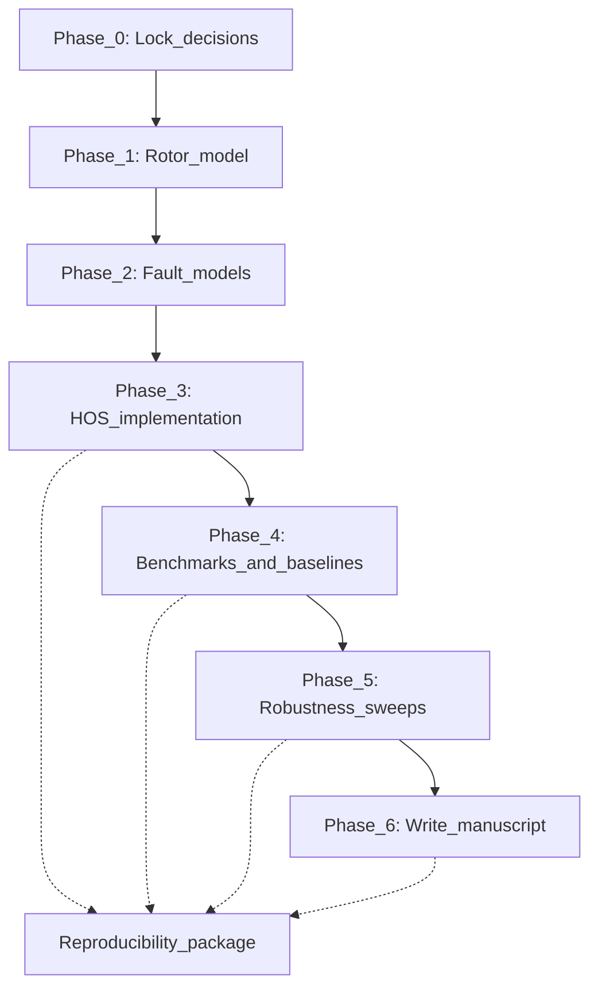

# Research Roadmap & Paper Outline

## 1. Your single core claim (write this down and do not drift)

> "A simulation-validated bicoherence pipeline provides robust, interpretable nonlinear coupling features that improve rotor fault diagnosis (crack vs misalignment) under realistic noise, sensor placement, and operating conditions, compared with second-order spectral baselines."

Adjust if you choose the nonstationary novelty (add "during run-up/run-down") or the stationary-only path (emphasize "benchmark-quality robustness").

> **Why lock this now?** Every simulation you run, every figure you produce, and every paragraph you write must serve this claim. If it does not, cut it. This prevents scope creep — the most common reason Master's projects run late.

---

## 2. Phase-by-phase execution plan

### Phase 0 — Lock decisions (1-2 days)

**What to do:**
1. Choose your primary novelty (Option A or B from [01_problem_and_contributions.md](01_problem_and_contributions.md)).
2. Freeze the scope: fault types, severity levels, speeds, noise levels, sensors.
3. Select your second benchmark paper and add it to `references.bib`.

**Deliverable:** A one-page "core claim" document (can be handwritten or a simple markdown file).

**Done when:** Your advisor has seen and agreed with the scope.

> **Why first?** Every later phase depends on these decisions. Changing them after Phase 2 means redoing weeks of work.

---

### Phase 1 — Build and validate the healthy rotor model (1-2 weeks)

**What to do:**
1. Build the FE rotor-bearing model in ROSS (elements, discs, bearings, damping).
2. Compute critical speeds and produce a Campbell diagram.
3. Simulate time responses at 2-3 speeds (below, near, above first critical).
4. Plot orbits and order spectra to verify physical plausibility.

**Deliverables (these become paper artifacts):**

| Artifact | Paper location |
|----------|---------------|
| Table: rotor model parameters | Section 3.1 (Table 1) |
| Figure: Campbell diagram / critical speeds | Section 7.2 (Figure 2) |
| Figure: sample time response + order spectrum | Section 7.2 (Figure 2) |

**Done when:** Healthy rotor plots look physically plausible and are stable across repeated runs.

> **Why validate healthy first?** If the healthy model has numerical problems, every fault result built on top of it will be wrong. This is your foundation.

---

### Phase 2 — Implement fault models (1-2 weeks)

**What to do:**
1. Implement the **breathing crack** model: time-varying stiffness at a defined location, with 3 severity levels (low/mid/high).
2. Implement the **misalignment** model: forcing/coupling with 3 severity levels.
3. Optionally add **unbalance** as a baseline (canonical, simple).
4. Generate faulted responses at one speed and verify expected signatures (harmonics, sidebands).

**Deliverables:**

| Artifact | Paper location |
|----------|---------------|
| Table: fault parameter mapping (severity to model parameters) | Section 3.2 (Table 2) |
| Figure: example responses per fault (time/orbit/order spectrum) | Section 7.4 |

**Done when:** Fault responses show expected qualitative signatures without numerical instability.

---

### Phase 3 — HOS implementation + sanity checks (1-2 weeks)

**What to do:**
1. Implement bicoherence computation (coherence-normalized bispectrum).
2. Define signal protocol: sampling frequency, duration, segmentation/windowing, overlap.
3. **Sanity check 1:** Apply to a synthetic signal with known quadratic phase coupling — verify correct peaks.
4. **Sanity check 2:** Apply to Gaussian noise — bicoherence should be near zero (quantify finite-sample bias).
5. Optionally implement tricoherence (only if you plan to test it).

**Deliverables:**

| Artifact | Paper location |
|----------|---------------|
| Table: signal protocol (fs, duration, windows, overlap, noise model) | Section 4 (Table 3) |
| Table: HOS settings (window length, normalization, thresholds) | Section 5 (Table 4) |
| Figure: HOS sanity checks on synthetic signals | Section 7.1 (Figure 1) |

**Done when:** HOS code correctly identifies known coupling and rejects noise.

> **Why sanity checks?** If your HOS code has a bug, everything downstream is invalid. Reviewers will specifically ask: "Did you validate your HOS implementation?" This is your answer.

---

### Phase 4 — Benchmarks + baselines (2-4 weeks)

**What to do:**
1. **Benchmark 1:** Replicate Sinha 2007 key results (bicoherence patterns for crack vs misalignment). Report quantitative match metrics.
2. **Benchmark 2:** Replicate results from your second selected paper. Same approach.
3. **Baseline 1:** Implement PSD/order spectrum features on the same data, same conditions.
4. **Baseline 2:** Implement envelope spectrum on the same data.
5. Compare: where does bicoherence outperform or complement the baselines?

**Deliverables:**

| Artifact | Paper location |
|----------|---------------|
| Table: benchmark replication summary + match metrics | Section 7.3 (Table 5) |
| Figure: reproduced benchmark plots | Section 7.3 (Figure 3) |
| Figure: bicoherence maps (healthy vs crack vs misalignment) | Section 7.4 (Figure 4) |
| Figure: baseline vs HOS diagnostic performance | Section 7.4 (Figure 5) |

**Done when:** At least 2 benchmarks are replicated with reported match metrics, and baselines are compared fairly.

> **Why benchmarks before robustness?** If you cannot replicate published results, you have a modeling problem that must be fixed before sweeping parameters.

---

### Phase 5 — Robustness sweeps (2-4 weeks)

**What to do:**
1. Sweep fault severity: 3 levels per fault.
2. Sweep noise: 3 SNR levels.
3. Sweep sensor location: 2 positions.
4. (If nonstationary claim) Sweep speed profiles: 2 run-up ramps.
5. Sweep HOS window length/overlap: show sensitivity.
6. Report confidence intervals or variability across realizations (use multiple noise seeds).

**Deliverables:**

| Artifact | Paper location |
|----------|---------------|
| Figure: performance vs severity and noise | Section 7.5 (Figure 6) |
| Figure: sensitivity to window/segment length | Section 7.5 (Figure 7) |
| Table: ablation summary (what matters, what does not) | Section 7.5 |
| Figure: nonstationary results (if included) | Section 7.6 (Figure 8) |

**Done when:** Results are stable and tell a clear story.

### Minimum simulation matrix

This is the smallest set of simulations that supports a credible paper:

| Factor | Levels | Values |
|--------|--------|--------|
| Fault type | 3 | healthy, crack, misalignment |
| Severity | 3 | low, mid, high (healthy = none) |
| Speed | 3 | below/near/above 1st critical |
| Noise (SNR) | 3 | high, medium, low |
| Sensor location | 2 | location A, location B |

**Total stationary cases:** 3 faults x 3 severities x 3 speeds x 3 noise x 2 sensors = 162 (+ healthy variants). Start with a reduced set (fix noise at one level) and expand.

---

### Phase 6 — Write manuscript (2-4 weeks)

**Write in this order** (de-risks the project):
1. Figures and tables first (they are already produced in Phases 1-5).
2. Results section (describe what the figures show).
3. Methods section (describe what you did to produce them).
4. Introduction and Related Work (now you know exactly what to claim).
5. Abstract and Conclusions (last, because they summarize everything).

> **Why this order?** Most beginners write the Introduction first and then realize their results do not match their claims. Writing results first prevents this.

---

## 3. Paper outline (MSSP/JSV-style)

### Working title
**Fault diagnosis in rotor-bearing systems using simulation-validated higher-order spectral coupling features**

### Sections and figure/table assignments

| Section | Content | Key artifacts |
|---------|---------|---------------|
| **Abstract** | Problem, gap, method, validation, results, contribution | — |
| **1. Introduction** | Context, why HOS, novelty sentence (line 10), 2-3 contributions, paper roadmap | — |
| **2. Related work** | Rotor fault signatures, HOS in diagnostics, "this work vs prior work" comparison table | Table: comparison |
| **3. Rotor model & faults** | 3.1 FE model (ROSS), 3.2 Fault models (crack, misalignment) | Tables 1-2 |
| **4. Signal protocol** | Sampling, noise, sensors, speeds, (run-up if included) | Table 3 |
| **5. HOS methodology** | Bicoherence definition, windowing, thresholds, (tricoherence if used) | Table 4 |
| **6. Baseline methods** | PSD/order, envelope; fairness constraints | — |
| **7. Results** | 7.1 HOS sanity checks, 7.2 Healthy validation, 7.3 Benchmarks, 7.4 Fault diagnosis, 7.5 Robustness, 7.6 Nonstationary (optional) | Figures 1-8, Table 5 |
| **8. Discussion** | Physics interpretation, when baselines fail, limitations, computational cost | — |
| **9. Conclusions** | Restate contributions, engineering takeaways, reproducibility statement | — |

### Figure list (quick reference)

| Figure | Content | Produced in |
|--------|---------|-------------|
| Fig 1 | HOS sanity checks (synthetic signals) | Phase 3 |
| Fig 2 | Healthy rotor validation (Campbell + response) | Phase 1 |
| Fig 3 | Benchmark replication plots | Phase 4 |
| Fig 4 | Bicoherence maps: healthy vs crack vs misalignment | Phase 4 |
| Fig 5 | Baseline vs HOS comparison | Phase 4 |
| Fig 6 | Robustness: performance vs severity/noise | Phase 5 |
| Fig 7 | Sensitivity to HOS parameters (window length) | Phase 5 |
| Fig 8 | Nonstationary run-up results (if included) | Phase 5 |

---

## Links
- Problem and contributions: [01_problem_and_contributions.md](01_problem_and_contributions.md)
- Publishability and gaps: [02_publishability_and_gaps.md](02_publishability_and_gaps.md)
- Track your progress: [04_checklist_and_risks.md](04_checklist_and_risks.md)
