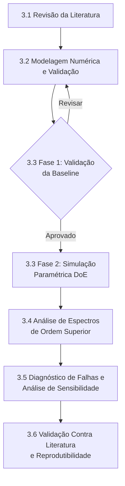

# Planejamento da Pesquisa

**Título Provisório**

>*Diagnóstico de Trinca e Desalinhamento em Sistemas Rotativos Utilizando Indicadores Bispectrais: Uma Investigação Numérica*

>*Rotor System Crack and Misalignment Diagnosis Using Bispectral Indicators: A Numerical Investigation*

## 1. Contextualização

Máquinas rotativas, como turbinas, compressores, bombas e geradores, estão presentes em setores estratégicos da indústria e sua indisponibilidade pode gerar perdas técnicas, econômicas e operacionais significativas. Entre as falhas mais relevantes nesse tipo de sistema, destacam-se as trincas em eixo e o desalinhamento, ambas capazes de produzir respostas dinâmicas não lineares e de difícil distinção quando se utilizam apenas técnicas clássicas de análise de vibrações.

A densidade espectral de potência (PSD), amplamente empregada no monitoramento de condição, é baseada em estatísticas de segunda ordem e, por isso, possui limitações para identificar acoplamentos de fase, interações não lineares e características não gaussianas do sinal. Nesse contexto, os espectros de ordem superior, em especial o bi-espectro, a bicoerência e o tri-espectro, surgem como alternativas promissoras para diferenciar assinaturas vibracionais associadas a diferentes tipos de falha.

Ao mesmo tempo, estudos experimentais nessa área costumam depender de bancadas específicas, com alto custo, baixa flexibilidade paramétrica e dificuldade de reprodução. Assim, propõe-se uma abordagem baseada em simulações numéricas com a biblioteca `ROSS`, buscando construir um fluxo reprodutível para geração de sinais, extração de indicadores por espectros de ordem superior e análise comparativa entre condições saudáveis e defeituosas.

### 1.1 Problema de Pesquisa

Como distinguir, de forma confiável e reprodutível, as falhas de trinca em eixo e desalinhamento em sistemas rotativos a partir de sinais simulados de vibração, utilizando espectros de ordem superior como ferramenta de diagnóstico?

### 1.2 Hipótese

Os espectros de ordem superior aplicados a sinais de vibração obtidos por simulação numérica são capazes de revelar acoplamentos não lineares e assinaturas de fase que permitem diferenciar, de forma quantitativa, condições saudáveis, trincas em eixo e desalinhamento em máquinas rotativas, superando as limitações da análise espectral tradicional baseada apenas na PSD.

## 2. Objetivo Geral

Desenvolver e avaliar uma metodologia computacional, baseada em simulações numéricas de elementos finitos (biblioteca ROSS) e análise de Espectros de Ordem Superior (bi-espectro e bicoerência), capaz de discriminar quantitativamente falhas de trinca respirante e desalinhamento em eixos rotativos, fornecendo um pipeline reprodutível e de código aberto que complemente ou reduza a dependência de bancadas experimentais.

## 3. Objetivos Específicos

Abaixo é apresentado o fluxograma das etapas da pesquisa, relacionando os objetivos específicos e os *gates* de aprovação:

### 3.1 Revisão da Literatura

   - Realizar uma revisão bibliográfica aprofundada sobre:
      - dinâmica de rotores;
      - modelagem de trincas e desalinhamento;
      - espectros de ordem superior;
      - técnicas de diagnóstico de falhas em máquinas rotativas.

### 3.2 Modelagem Numérica e Validação

- Construir modelos de elementos finitos de um sistema rotor-mancal utilizando a biblioteca ROSS, incluindo efeitos giroscópicos, rigidez e amortecimento dos mancais.
- Implementar o modelo de trinca respirante com rigidez variável no tempo (modelo Mayes-Davies e Gash).
- Implementar o modelo de forçamento por desalinhamento com excitação harmônica em 1X, 2X e 3X.
- Validar os modelos desenvolvidos comparando frequências naturais e resposta ao desbalanceamento com dados publicados na literatura.

### 3.3 Campanha de Simulação Paramétrica (Phase 2)

- **Fase 1 (Validação):** Validar a baseline do pipeline numérico contra resultados experimentais da literatura (e.g., Sinha, 2007) avaliando a topologia dos espectros e a reprodução de características chave.
- **Fase 2 (DoE):** Somente após a validação bem-sucedida (Fase 1), projetar um estudo paramétrico sistemático (Planejamento de Experimentos) cobrindo:
  - Razão de profundidade da trinca (a/D = 0,0 a 0,5)
  - Ângulo de desalinhamento (0,0° a 2,0°)
  - Velocidade de rotação (0,5× a 1,5× velocidade crítica)
  - Razão de amortecimento (0,01 a 0,05)
- Gerar e armazenar sinais de vibração simulados em formato estruturado para as condições saudável, trinca e desalinhamento.

### 3.4 Análise de Espectros de Ordem Superior

- Implementar algoritmos computacionais para estimação do bi-espectro (método direto com média por segmentos) e da bicoerência.
- Definir indicadores quantitativos de falha extraídos dos HOS:
  - Razão de Picos Bispectrais (BPR)
  - Soma da Bicoerência (BCS)
  - Entropia Bispectral (BE)
  - Bifase em frequências-chave
- Aplicar o pipeline HOS ao conjunto completo de simulações e construir a matriz de características para classificação.

### 3.5 Diagnóstico de Falhas e Análise de Sensibilidade

- Avaliar a capacidade dos indicadores HOS de discriminar entre condições saudável, trinca e desalinhamento por meio de métricas de separabilidade (matriz de confusão, curvas ROC ou acurácia de classificação).
- Realizar análise de sensibilidade dos indicadores em relação à severidade da falha, velocidade de rotação e amortecimento.
- Comparar o desempenho dos indicadores HOS com indicadores tradicionais baseados em PSD.

### 3.6 Validação Contra Literatura e Reprodutibilidade

- Comparar padrões de bi-espectro e bicoerência obtidos numericamente com resultados experimentais publicados, em particular Sinha (2007).
- Documentar e disponibilizar publicamente todo o código e dados (GitHub + Zenodo), garantindo reprodutibilidade completa do estudo.

## 4 Questões Norteadoras

### 4.1 Questão central

Os espectros de ordem superior aplicados a sinais obtidos por simulações numéricas de rotores são capazes de distinguir, de forma confiável e quantitativa, as assinaturas não lineares associadas a trinca em eixo e desalinhamento?

### 4.2 Desmembramento das questões

1. O modelo FEM via ROSS reproduz adequadamente o comportamento dinâmico de rotores com trinca respirante e desalinhamento?

Os padrões HOS numéricos são consistentes com resultados experimentais publicados (Sinha, 2007)?

2. Quais características dinâmicas não lineares produzidas por trinca e desalinhamento podem ser identificadas por espectros de ordem superior?

3. Em que medida o bispectro e a bicoerência conseguem distinguir falhas com conteúdo espectral semelhante na PSD?

4. Quais indicadores escalares apresentam maior robustez para classificação entre rotor saudável, trincado e desalinhado?

5. Como a severidade da falha e a velocidade de rotação influenciam os padrões bispectrais observados?

Os indicadores HOS superam indicadores tradicionais (PSD) na discriminação de falhas com assinaturas frequenciais similares?

6. Até que ponto uma abordagem numérica com ferramentas open source pode fornecer resultados comparáveis aos reportados em estudos experimentais da literatura?

A metodologia proposta é robusta o suficiente para diferentes configurações de parâmetros e níveis de ruído?

## 4.3 Mapeamento Questões-Objetivos

| # | Questão Norteadora | Objetivo Relacionado | Tipo de Investigação |
|---|---|---|---|
| Q1 | O modelo FEM via ROSS reproduz adequadamente o comportamento dinâmico de rotores com trinca respirante e desalinhamento? | 3.2 — Modelagem Numérica e Validação | Desenvolvimento e Validação |
| Q2 | Os padrões HOS numéricos são consistentes com resultados experimentais publicados (Sinha, 2007)? | 3.6 — Validação Contra Literatura e Reprodutibilidade | Validação |
| Q3 | Quais características dinâmicas não lineares produzidas por trinca e desalinhamento podem ser identificadas por espectros de ordem superior? | 3.4 — Análise de Espectros de Ordem Superior | Análise Exploratória |
| Q4 | Em que medida o bispectro e a bicoerência conseguem distinguir falhas com conteúdo espectral semelhante na PSD? | 3.4 / 3.5 — Análise HOS e Diagnóstico de Falhas | Análise Comparativa |
| Q5 | Quais indicadores escalares apresentam maior robustez para classificação entre rotor saudável, trincado e desalinhado? | 3.5 — Diagnóstico de Falhas e Análise de Sensibilidade | Análise Quantitativa |
| Q6 | Como a severidade da falha e a velocidade de rotação influenciam os padrões bispectrais observados? | 3.3 / 3.5 — Simulação Paramétrica e Análise de Sensibilidade | Análise de Sensibilidade |
| Q7 | Os indicadores HOS superam indicadores tradicionais (PSD) na discriminação de falhas com assinaturas frequenciais similares? | 3.5 — Diagnóstico de Falhas e Análise de Sensibilidade | Análise Comparativa |
| Q8 | Até que ponto uma abordagem numérica com ferramentas open source pode fornecer resultados comparáveis aos reportados em estudos experimentais da literatura? | 3.6 — Validação Contra Literatura e Reprodutibilidade | Validação |
| Q9 | A metodologia proposta é robusta o suficiente para diferentes configurações de parâmetros e níveis de ruído? | 3.3 / 3.5 — Simulação Paramétrica e Análise de Sensibilidade | Análise de Robustez |

## Contribuições Esperadas

- Propor um fluxo metodológico integrado entre modelagem numérica em rotores e análise por espectros de ordem superior.

- Produzir uma base reprodutível de sinais simulados para estudo de falhas em máquinas rotativas.

- Estabelecer indicadores quantitativos para diferenciação entre trinca em eixo e desalinhamento.

- Fortalecer o uso de ferramentas open source no contexto de diagnóstico de falhas e monitoramento de condição.

- Gerar resultados com potencial de publicação científica em periódicos da área de dinâmica, vibrações e monitoramento estrutural.

## Delimitação do Estudo

Este trabalho terá foco em uma investigação numérica. A validação será conduzida prioritariamente por comparação com resultados já publicados na literatura, não incluindo, em um primeiro momento, uma campanha experimental própria. O escopo inicial concentra-se nas falhas de trinca em eixo e desalinhamento, podendo ser expandido futuramente para outras condições, como desbalanceamento, folgas ou defeitos em mancais.

## Resultados Esperados

Ao final da pesquisa, espera-se obter:

- um modelo numérico validado de rotor em condição saudável e com falhas;
- um conjunto estruturado de simulações paramétricas;
- ferramentas computacionais para análise por bispectro e bicoerência;
- indicadores quantitativos capazes de diferenciar padrões dinâmicos associados às falhas estudadas;
- material técnico-científico suficiente para compor a dissertação e subsidiar a redação de artigo para submissão em periódico.