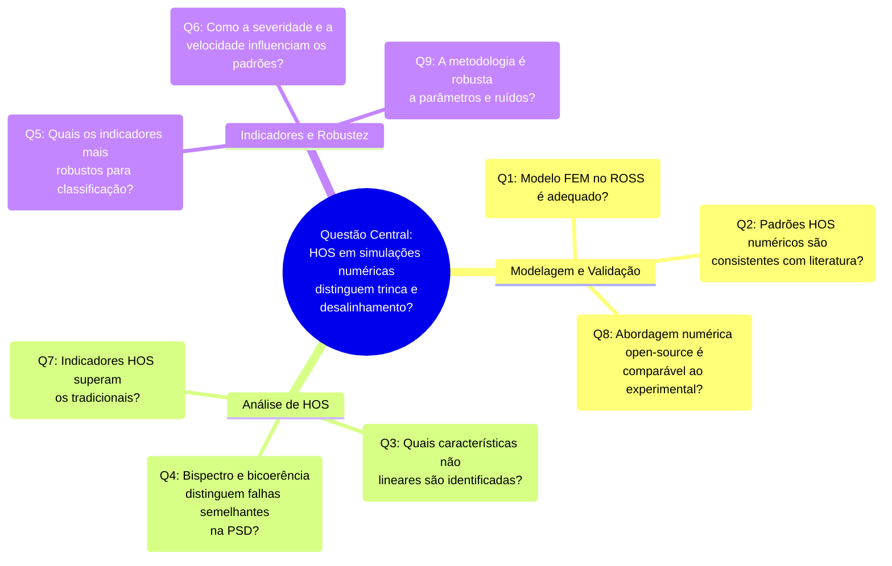

# Mind Map das Questões Norteadoras

Este documento apresenta o mapa mental estruturado com base nas Questões Norteadoras do projeto de pesquisa, agrupadas por suas categorias lógicas.

```mermaid
mindmap
  root((Questão Central:<br/>HOS em simulações numéricas<br/>distinguem trinca e<br/>desalinhamento?))
    Modelagem e Validação
      Q1(Q1: Modelo FEM no ROSS é adequado?)
      Q2(Q2: Padrões HOS numéricos são<br/>consistentes com literatura?)
      Q8(Q8: Abordagem numérica open-source é<br/>comparável ao experimental?)
    Análise de HOS
      Q3(Q3: Quais características não<br/>lineares são identificadas?)
      Q4(Q4: Bispectro e bicoerência<br/>distinguem falhas semelhantes<br/>na PSD?)
      Q7(Q7: Indicadores HOS superam<br/>os tradicionais?)
    Indicadores e Robustez
      Q5(Q5: Quais os indicadores mais<br/>robustos para classificação?)
      Q6(Q6: Como a severidade e a<br/>velocidade influenciam os padrões?)
      Q9(Q9: A metodologia é robusta<br/>a parâmetros e ruídos?)
```
